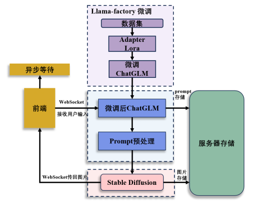
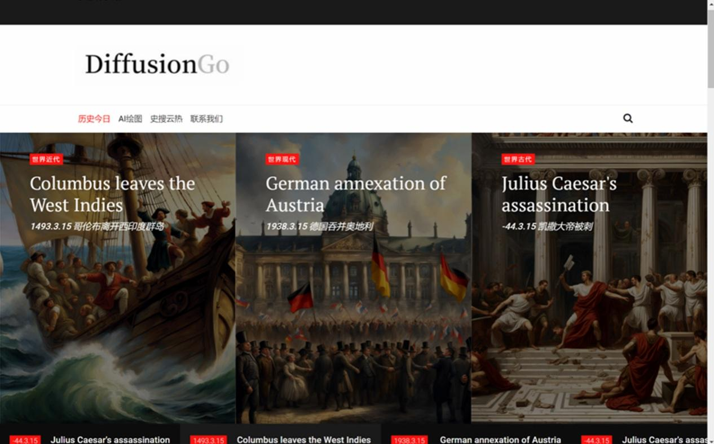
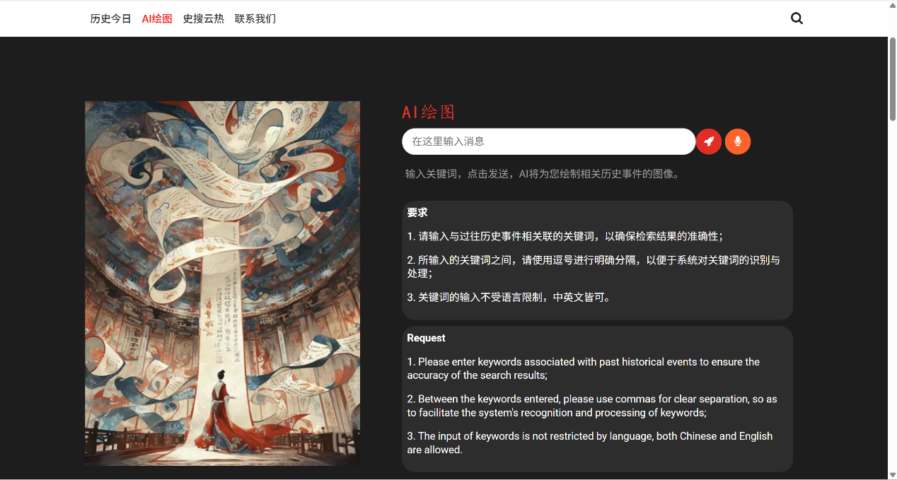
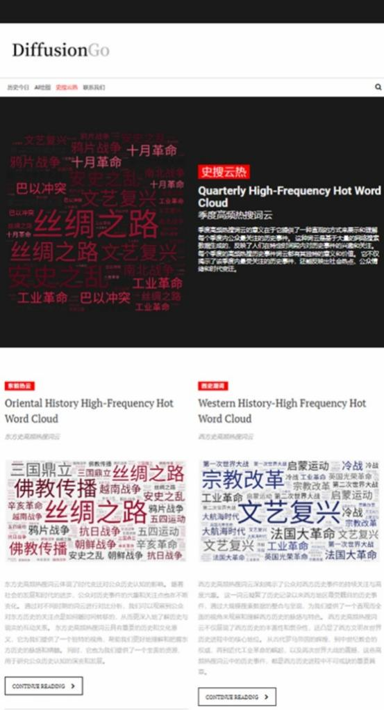
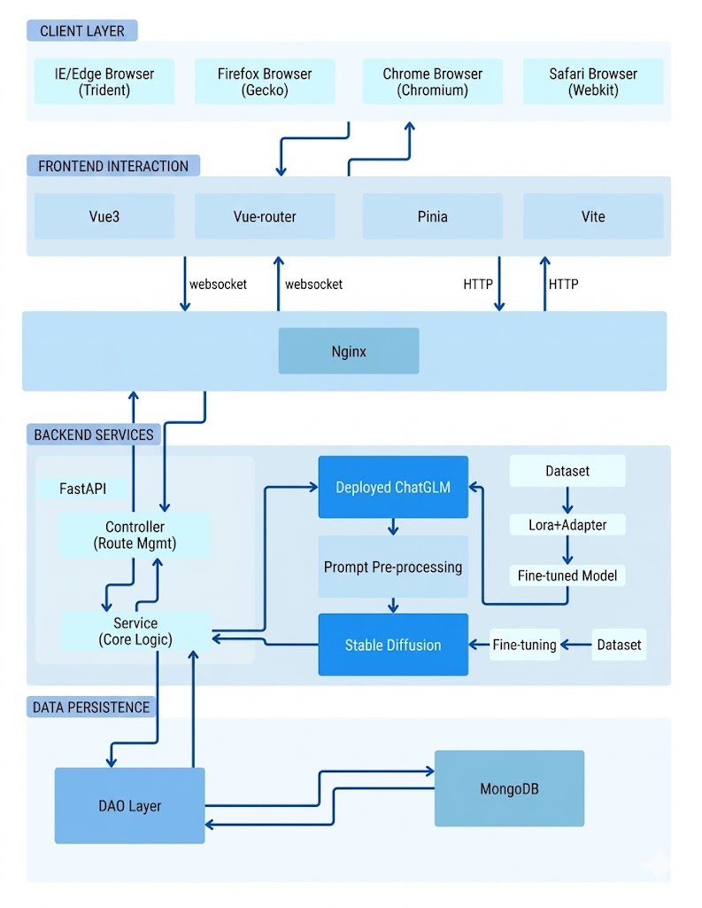

# EchoPast - AI历史教育平台

## 项目简介

**EchoPast** 是一个创新的历史教育AI应用平台，通过结合大语言模型（ChatGLM-6B）和图像生成技术（Stable Diffusion），为用户提供全新的历史学习体验。平台能够根据用户输入的历史事件或主题，自动生成高质量的历史场景图片，让历史教育变得更加生动、直观和有趣。

> **访问地址**: [http://111.230.70.21:8088/static/index.html](http://111.230.70.21:8088/static/index.html) 

## 核心功能

### 📅 历史今日
展示历史上的今日发生的重大历史事件，所有配图均由AI自动生成，让用户直观感受历史时刻。

### 🎨 AI绘图
用户只需输入历史主题（如"诺曼底登陆"、"虎门销烟"等），系统会自动：
1. 通过微调的ChatGLM-6B模型理解用户意图
2. 生成优化的Stable Diffusion提示词
3. 生成高质量的历史场景图片

### 🔥 史搜云热
实时展示用户在季度内高频搜索的历史关键词，反映当前用户关注的历史热点话题。

## 技术架构

### 系统架构图

### 技术栈

#### 前端
- **框架**: HTML5 + CSS3 + JavaScript
- **部署**: 腾讯云服务器
- **响应式设计**: 支持多端访问

#### 后端
- **语言模型**: ChatGLM-6B (60亿参数)
- **图像生成**: Stable Diffusion
- **微调技术**: 
  - LoRA (Low-Rank Adaptation)
  - Adapter
  - QLoRA 4-bit/8-bit量化
- **微调平台**: LLAMA-factory
- **部署优化**: 模型量化、截断长度优化

#### 基础设施
- **服务器**: 腾讯云ECS
- **GPU**: NVIDIA Tesla系列
- **内存**: 16GB+
- **存储**: SSD云硬盘

## 创新特色

### 🎯 专业化历史教育
- **领域专注**: 专门针对历史教育场景进行模型微调
- **数据集**: 人工标注的历史事件指令数据集
- **准确性**: 高质量的历史事件理解和图片生成

### ⚡ 智能提示词优化
- **自动优化**: ChatGLM-6B自动生成Stable Diffusion提示词
- **精准匹配**: 提示词与历史事件高度相关
- **降低门槛**: 用户无需了解复杂参数设置

### 🖼️ 视觉化历史体验
- **填补空白**: 解决历史图片资源匮乏问题
- **增强记忆**: 视觉化帮助用户更好地理解和记忆历史
- **艺术价值**: 生成的图片兼具历史准确性和艺术美感

## 使用指南

### 快速开始
1. 访问 [http://111.230.70.21:8088/static/index.html](http://111.230.70.21:8088/static/index.html)
2. 选择功能模块（历史今日 / AI绘图 / 史搜云热 / 联系我们）
3. 在AI绘图模块中输入历史主题（如"法国大革命"、"丝绸之路"等）
4. 等待图片生成（通常10-30秒）
5. 右键点击生成的图片进行保存或复制

### 输入建议
- **具体历史事件**: "诺曼底登陆"、"虎门销烟"、"五四运动"
- **历史时期**: "唐朝盛世"、"文艺复兴"、"工业革命"
- **历史人物**: "拿破仑加冕"、"爱因斯坦演讲"、"李白饮酒作诗"

### 注意事项
- 避免输入敏感或不当内容
- 复杂的历史场景可能需要更长的生成时间
- 建议使用具体的、有明确视觉元素的历史主题

## 项目优势

### 📊 市场定位
- **目标用户**: 历史爱好者、学生、教育工作者
- **竞争优势**: 市场上少有的专注于历史教育的AI图像生成平台
- **教育价值**: 符合现代教育对可视化、互动化学习的需求

### 🏆 技术优势
- **模型性能**: 通过量化和优化，在有限硬件上高效运行
- **生成质量**: 微调后的模型生成图片更符合历史事实
- **用户体验**: 简单易用，无需技术背景

## 开发与部署

### 开发流程
采用敏捷开发模式，使用Git进行版本控制，支持团队协作开发。

### 部署环境
- **操作系统**: Ubuntu 20.04 LTS
- **Python版本**: 3.8+
- **CUDA版本**: 11.7+
- **依赖库**: PyTorch, Transformers, Diffusers等

### 性能优化
- **模型量化**: QLoRA 4-bit/8-bit减少显存占用
- **异步处理**: 避免并发请求导致的GPU内存不足
- **缓存机制**: 常用历史事件图片缓存加速访问

## 未来规划

### 📈 功能扩展
- 扩充历史事件和人物数据库
- 增加多语言支持
- 开发移动端应用

### 🤖 技术升级
- 集成更先进的大语言模型（如ChatGLM-130B）
- 探索GAN等新技术生成更多样化的历史场景
- 优化微调方法，提高生成质量和速度

### 🎓 教育合作
- 与学校和教育机构合作
- 开发课程配套的历史可视化工具
- 建立历史教育资源共享平台

## 联系我们

- **项目地址**: [GitHub仓库链接]（待补充）
- **技术支持**: [support@echopast.com]（待补充）
- **商务合作**: [business@echopast.com]（待补充）

## 致谢

感谢以下开源项目和技术的支持：
- [ChatGLM-6B](https://github.com/THUDM/ChatGLM-6B)
- [Stable Diffusion](https://github.com/CompVis/stable-diffusion)
- [LLaMA-Factory](https://github.com/hiyouga/LLaMA-Factory)
- [LoRA](https://arxiv.org/abs/2106.09685)

---

**EchoPast - 让历史触手可及，让教育更加生动！**